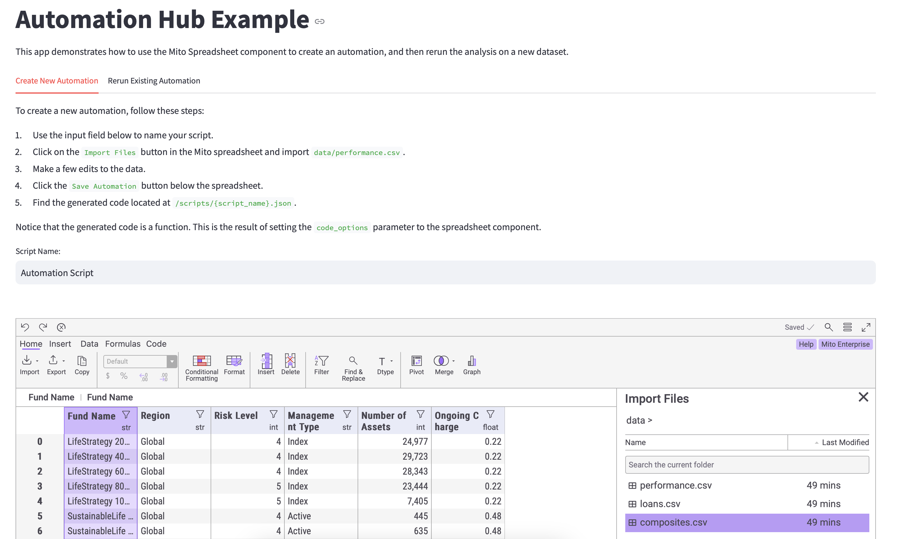

# Automation Hub Example

This repo is a simple example of how to use the Mito Automation Hub to save and rerun automations on different datasets.



### Run the app locally:
1. Clone this repo
2. Create a virtual environment 
```
python3 -m venv mitoenv
```
3. Activate the virtual environment (windows)
```
mitoenv\Scripts\activate.bat
```
4. Install the requirements
```
pip install -r requirements.txt
```
5. Run the app
```
streamlit run main.py
```

